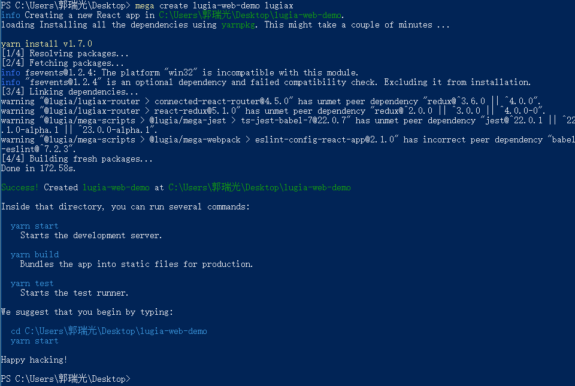

# 快速上手

Lugia Web 旨在降低开发成本，提升开发质量，为前端开发人员赋能，让用户体验知性。

## 说在前面

在使用 `lugia-web` 之前，我们建议你已经对 [React](http://facebook.github.io/react/) 和 [ES2015](https://babeljs.io/docs/en/learn) 有过学习，
并且配置了 [Node.js](https://nodejs.org/en/) v8 版本及以上。

## 创建一个本地实例

项目开发过程中，你会需要对 ES2015 和 jsx 的代码的构建、调试、打包部署等一系列需求。我们为此提供了 lugia-mega(一个基于前端物料库体系的可视化开发工具)，
下面我们用实例来进行说明。

### 1.安装脚手架工具

```bash
## 安装
$ npm install @lugia/mega -g

## 查看版本
$ mega -V
1.0.3

## 帮助
$ mega -h
```

### 2.创建一个项目

```bash

## 初始化一个 react app
$ mega create <app-name> [scaffolding]
```

### Scaffolding

> 空值时会下载默认脚手架项目

#### lugiax
Use @lugia/lugiax、@lugia/lugia-web、@lugia/lugiax-router

#### dva
Use [dva](https://github.com/dvajs/dva)

#### cra
create-react-app

下面我们来安装脚手架

```bash
## 安装
$ yarn global add @lugia/mega

##安装成功后，运行
$ mega create lugia-web-demo lugiax
```


到这里，一个了不起的项目已经安装成功了。

### 3.使用组件

脚手架会生成一个应用实例，我们可以先不使用它，先来试用我们的组件吧：
可以用下面代码替换掉 `src/index.js` 的内容。

```javascript
import React from 'react';
import ReactDOM from 'react-dom';
import '@lugia/lugia-web/dist/css/global.css';
import { Button } from '@lugia/lugia-web';

class App extends React.Component {
    render(){
        return (
            <div>
                <Button type="success">Success</Button>
            </div>
        );
    }
}

ReactDOM.render(<App />, document.getElementById('root'));
```

可以在组件库中试用更多组件。

### 4.开发调试

```bash
$ yarn start
```

运行命令，在浏览器查看效果和调试。

### 5.构建和部署

```bash
$ yarn build
```

打包后的文件会构建到 `dist` 目录中，可以自由部署到不同环境中。


